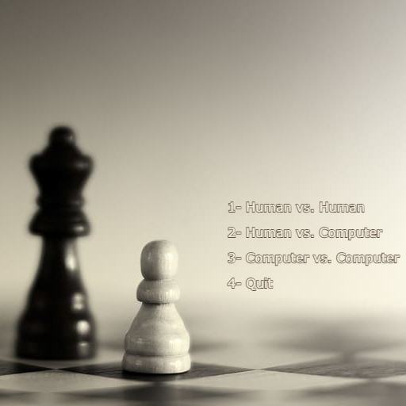
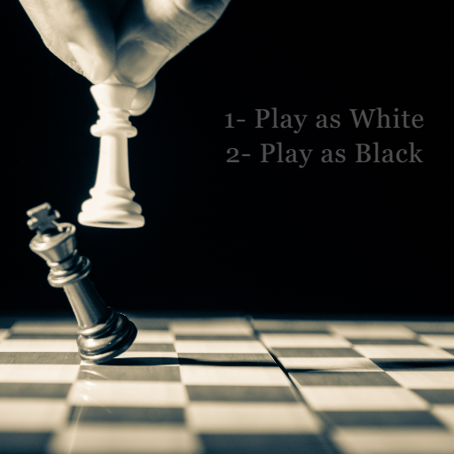

# Chess AI

## Table of contents
- [Chess AI](#chess-ai)
  - [Table of contents](#table-of-contents)
  - [Description](#description)
  - [Components](#components)
  - [Technologies](#technologies)
  - [Setup](#setup)
      - [Controls:](#controls)
  - [Interface:](#interface)

## Description
This project contains a basic chess AI that can play against a human player or another AI. The AI uses the `minimax` and `negamax` algorithm with `alpha-beta pruning` to search for the best move.

## Components
* `main.py` - The main driver file that handles user input, graphics, and game logic.
* `Mechanics.py` - Contains the GameState class that tracks the current state of the chess game.
* `AI_Engine.py` - Contains the minimax alpha-beta search algorithm and board evaluation function.

## Technologies
* Python 3.9.13
* pygame 2.3.0

## Setup
1. Install Python 3.9.13 and Pygame 2.3.1
2. Clone this repository
3. Run python main.py
4. Select to play against the AI, watch the AI vs AI, or play local multiplayer
5. Have fun!

#### Controls:   
* Click to select a piece and see possible moves
* Click again to make a move
* `a` to undo a move
* `s` to reset the game
* `d` to toggle background music

## Interface: 

