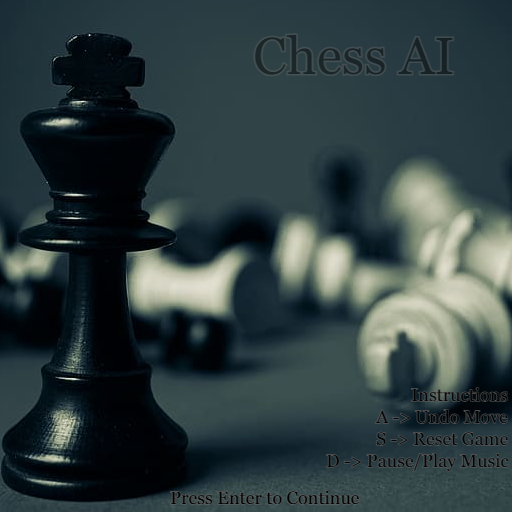

# Chess AI

## Table of contents
- [Chess AI](#chess-ai)
  - [Table of contents](#table-of-contents)
  - [Description](#description)
     - [NegaMax:](#negamax)
     - [MiniMax:](#minimax)
  - [Chess Graph](#chess-graph)
  - [Components](#components)
  - [Technologies](#technologies)
  - [Setup](#setup)
      - [Controls:](#controls)
  - [Interface:](#interface)

## Description
This project contains a basic chess AI that can play against a human player or another AI. The AI uses the `minimax` and `negamax` algorithm with `alpha-beta pruning` to search for the best move.

#### NegaMax:
The NegaMax algorithm with alpha-beta pruning is a variation of the NegaMax algorithm that further improves its efficiency by reducing the number of nodes that need to be evaluated.

During the search, if the algorithm finds a node with a score that exceeds the current alpha or beta value, it can immediately prune the rest of that node's subtree, since it is not necessary to evaluate any further nodes in that subtree. This can significantly reduce the number of nodes that need to be evaluated, especially in deep search trees.

The NegaMax algorithm with alpha-beta pruning works by negating the score values of each node in the game tree, so that the maximizing player becomes the minimizing player and vice versa. This allows the algorithm to use the same alpha-beta pruning technique as in the minimax algorithm but with only one set of values, rather than separate values for each player.

#### MiniMax:
The minimax algorithm with alpha-beta pruning is a well-known search algorithm used in two-player games to determine the optimal move for a player, assuming that the opponent also plays optimally. 

The algorithm works by performing a depth-first search of the game tree, evaluating each position and assigning it a score that represents the expected outcome of the game for the player. The algorithm alternates between maximizing the score for the current player and minimizing the score for the opponent. 

During the search, if the algorithm finds a node with a score that exceeds the current alpha or beta value, it can immediately prune the rest of that node's subtree, since it is not necessary to evaluate any further nodes in that subtree. This can significantly reduce the number of nodes that need to be evaluated, especially in deep search trees.

The minimax algorithm with alpha-beta pruning is a powerful and widely used technique for game tree search in two-player games, such as chess, checkers, and Go. It is particularly effective when the search tree is large and deep, making it infeasible to evaluate all possible moves.

## Chess Graph

## Components
* `main.py` - The main driver file that handles user input, graphics, and game logic.
* `Mechanics.py` - Contains the GameState class that tracks the current state of the chess game.
* `AI_Engine.py` - Contains the minimax alpha-beta search algorithm and board evaluation function.

## Technologies
* Python 3.9.13
* pygame 2.3.0

## Setup
1. Install Python 3.9.13 and Pygame 2.3.1
2. Clone this repository
3. Run python main.py
4. Select to play against the AI, watch the AI vs AI, or play local multiplayer
5. Have fun!

#### Controls:   
* Click to select a piece and see possible moves
* Click again to make a move
* `a` to undo a move
* `s` to reset the game
* `d` to toggle background music

## Interface: 

